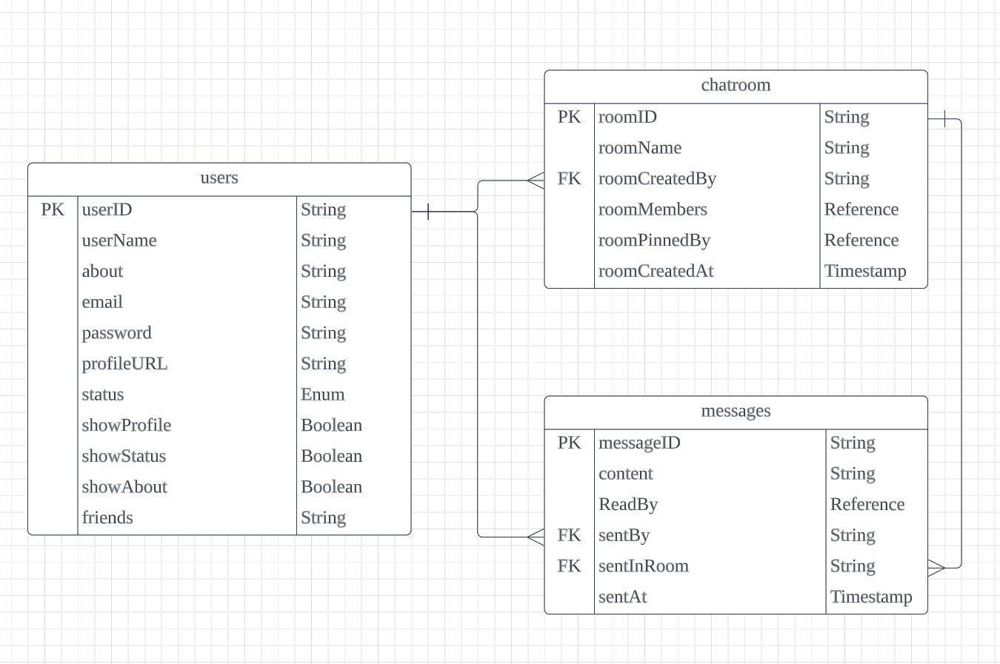
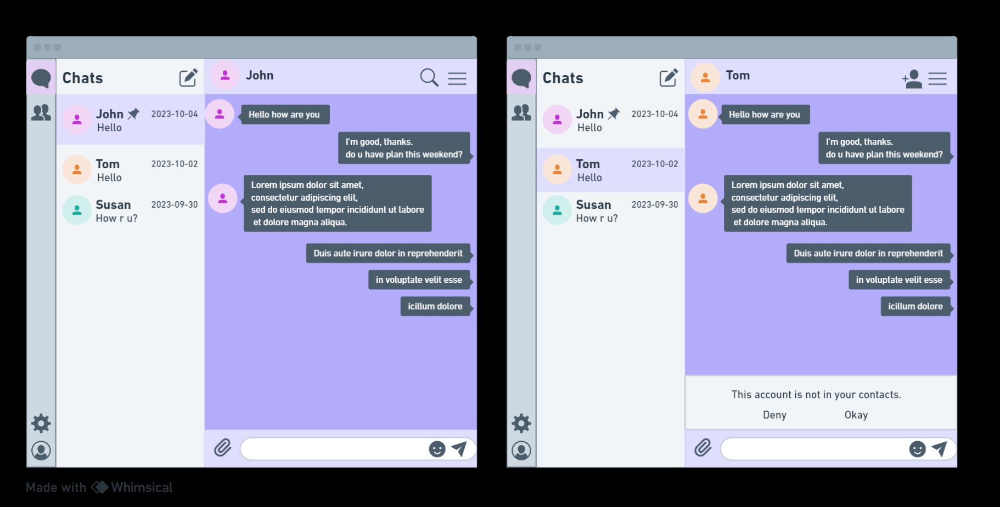
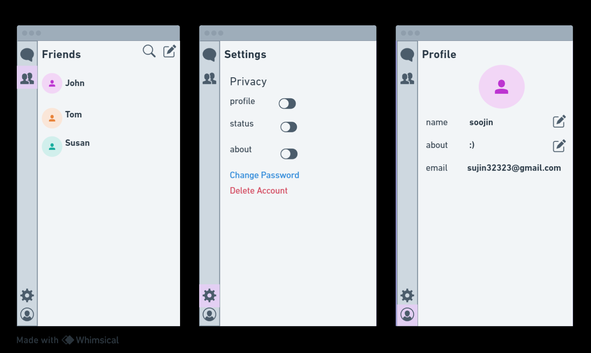

# chatapp-soojin-yen-bosco-final
Realtime Chat Application using MERN Stack  

Our real-time chat application provides a simple and user-friendly platform for one-on-one chat or group discussions.  

- __ERD__
  

- __Wireframes__
  
  
  
- __User stories__ 
  1. Sending a Message  
   As a user,  
   I want to send a text message to another user in a chat room,  
   so that I can communicate with them in real-time.  

   2. Receiving Message Notifications  
   As a user,   
   I want to receive notifications when I receive a message from a stranger,  
   so that I can choose to answer or deny to the message.  

   3. Adding Friends  
   As a user,  
   I want to be able to add other users as friends or connections,  
   so that I can easily initiate private conversations and see when they are online.  
   4. Customizing My Profile  
   As a user, I want to be able to customize my profile by adding a profile  picture, updating my status, and providing some personal information,  
   so that I can personalize my presence in the chat application and share some details with others.  

   5. Changing User Settings  
   As a user, I want to be able to customize my account settings,  
   so that I can control my privacy.  

   6. Manage Friends List  
   As a user, I want to be able to manage my list of friends or connections,  
   so that I can organize and interact with my friends.  

- __User scenarios__ 
   1. Sending a Message  
   Given I am logged into the chat application  
   When I select a user from my friends list  
   And I type a message  
   And I click the "Send" button  
   Then the message is sent to the selected user in real-time  
   And I can see the sent message in the chat window 

   2. Receiving Message Notifications  
   Given I am logged into the chat application  
   And I have a chat window open  
   When I receive a new message from another user  
   Then a notification is displayed in the chat window  
   And I can see the new message  

   3. Adding Friends  
   Given I am logged into the chat application  
   When I search for a specific user by their username  
   And I send a friend request  
   Then the other user receives the friend request notification  
   And they can accept or decline the request 
   4. Customizing My Profile  
   Given I am logged into the chat application  
   When I access my profile settings  
   And I upload a profile picture  
   And I update my status and personal information  
   Then my profile is updated with the new information  
   And other users can see my profile picture and status 

   5. Changing User Settings  
   Given I am logged into the chat application  
   When I access my account settings  
   And I navigate to the "Privacy" section  
   And I toggle the options for profile visibility,status visibility and about  visibility Then my account settings are updated as per my selections  
   And profile, status and about is shown based on my chosen preferences 

   6. Manage Friends List  
   Given I am logged into the chat application  
   When I access the "Friends" section  
   And I can view my list of friends  
   And I have options to add or remove friends  
   Then I can organize and interact with my social network by managing my list of friends. 

- __Tech stack - MERN stack (MongoDB, Express, React, Node.js)__
  
  1. Front-End : React, Redux, React Router, WebSocket Library  
  2. Back-End : Node.js, Express, WebSocket Library  
  3. Database : MongoDB  

- __Feature list & Roles Overview__ 
  1.  Back-End (soojin)  
      [ ] set up the server using Node.js and Express.  
      [ ] develop API routes for user authentication, chat rooms, messages, and user profiles.   

  2.  Front-End  (bosco, yen)   
      [ ] basic design
   
  3.  Database Integration  (soojin)  
      [ ] set up the schema for users, chat rooms, and messages.  
      [ ] implement database CRUD operations.  

  4. User account and authentication  (yen)  
     [ ] user registration    
     [ ] user login  
     [ ] user login using google API  --bonus
     [ ] user login using facebook API  --bonus
     [ ] find password -> password reset  
     [ ] use passport authentication  

  5. Real-Time Chat Functionality (soojin)
     [ ] set up real-time communication using Socket.io library  
     [ ] implement basic functionality - sending and receiving messages.   

  6. Setting - User Profile  
     [ ] allow users to edit their profiles.  
     [ ] display or hide user profiles.  

  7. ChatRoom  
     [ ] allow users to create one-to-one chatroom.  
     [ ] allow users to create group chatroom.  

  8. Message Features  
     [ ] enable users to send text, images, and attachments in chat messages.  
     [ ] implement message editing and deleteing functionality.  
     [ ] enable users to see translations of the messages.  
     [ ] enable to use emoji picker.  
     [ ] message read recipt  

  9.  Notifications  
     [ ] send real-time notifications for new messages.  

  10. Search Functionality  
     [ ] implement a search feature for finding users and chat rooms.   
     [ ] allow users to search for messages within chatrooms.  
  11. Security and Authorization  
      [ ] ensure that users can only access their own messages and profile information.  

  12. Deployment and Hosting
  13. Testing and Bug Fixes
  14. Documentation and Presentation Scenario